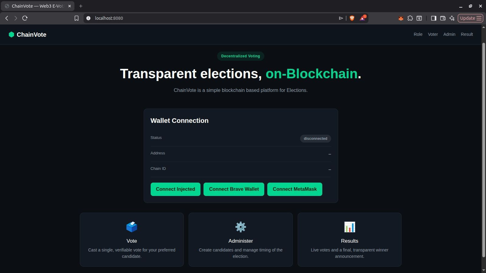
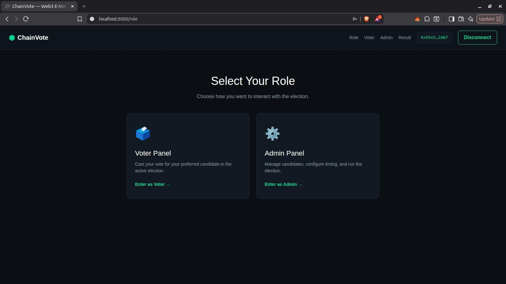
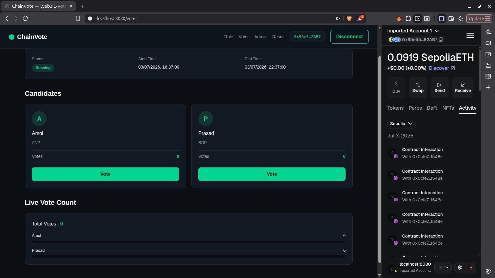
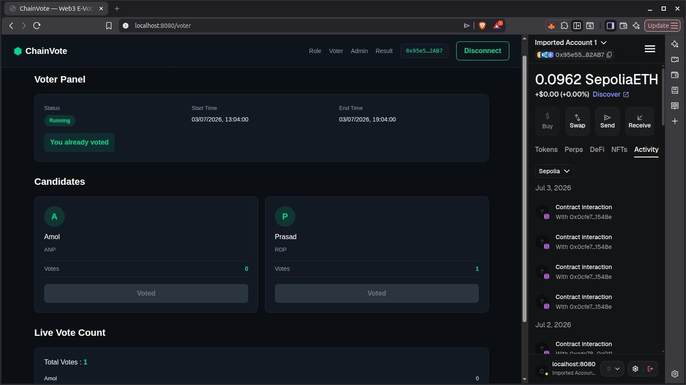
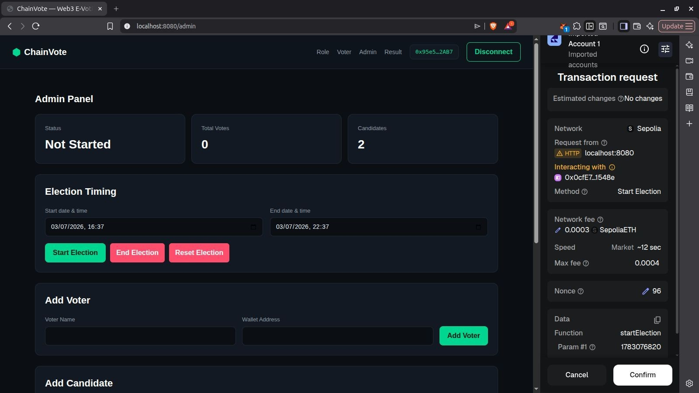
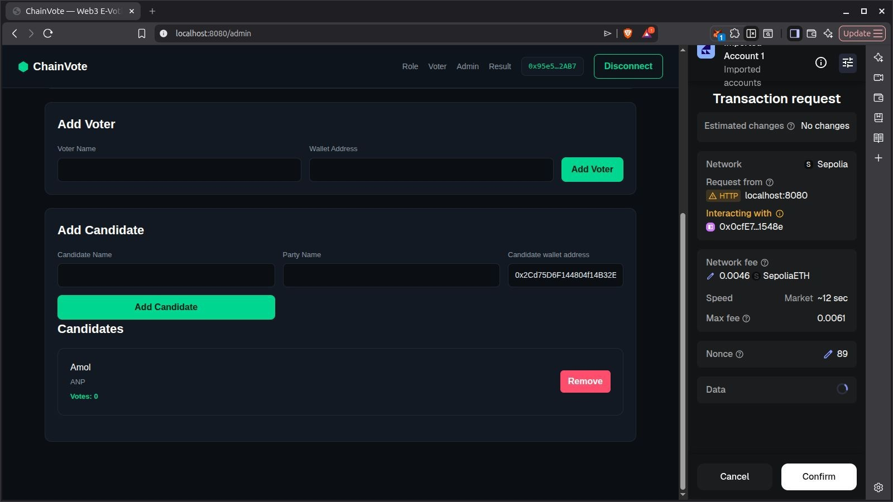

# ChainVote — Blockchain-Based E-Voting System

ChainVote is a blockchain-based e-voting system designed to provide a secure, transparent, and tamper-resistant platform for conducting elections using Ethereum smart contracts.

## Features

* 🔐 Secure voter authentication
* 🗳️ Blockchain-based vote recording
* 👨‍💼 Admin election management
* 📊 Transparent election results
* 🔗 MetaMask wallet integration
* ⛓️ Ethereum smart contract integration
* ⚡ React-based user interface

## Tech Stack

* **Frontend:** React, Vite, CSS
* **Blockchain:** Ethereum / Sepolia
* **Smart Contract:** Solidity
* **Web3:** Wagmi
* **Wallet:** MetaMask
* **Tools:** Node.js, Foundry

## How It Works

1. Connect the MetaMask wallet.
2. Select the appropriate user role.
3. Voters authenticate and cast their vote.
4. The vote is recorded through the Ethereum smart contract.
5. Admin manages election data.
6. Election results are retrieved and displayed transparently.

## Screenshots

### Homepage



### Role Selection



### Voting Page



### Voted Confirmation



### Admin Dashboard



### Add Data



### Final Results


## Installation

### Clone the Repository

```bash
git clone <your-repository-url>
cd "E-Voting Using Blockchain"
```

### Frontend

```bash
cd e-voting-blockchain
npm install
npm run dev
```

### Smart Contract

Navigate to the Solidity backend:

```bash
cd ../solidity-BE
```

Install the required Foundry dependencies and configure the contract according to the project setup.

## Security

The system uses Ethereum smart contracts to record votes on the blockchain, providing transparent and tamper-resistant vote records. MetaMask is used for wallet-based interaction with the blockchain.

## Future Improvements

* Multi-election support
* Enhanced voter verification
* Improved admin dashboard
* Transaction status notifications
* Deployment on Ethereum mainnet

## Author

**Amol Patangrao**

MCA — Computer Science
Savitribai Phule Pune University

